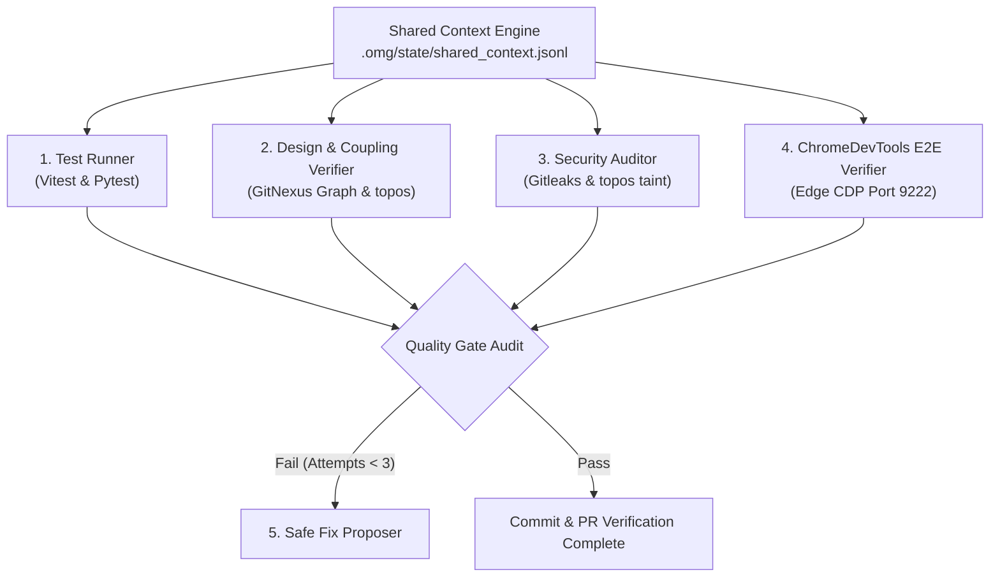

# Subagent Swarm Quality Verification Skill

This workspace skill defines the orchestration protocol for the multi-agent QA and verification swarm, aligning strictly with the architecture defined in [[production_agentic_pipeline_v2_1_blueprint]] and [[commit_creator_architecture_verifier_blueprint]].

---

## 1. Execution Profiles

When this skill is activated, the agent must parse the target profile to establish the verification lane:

| Profile | Trigger Condition | Mandatory Gates & Checks |
| :--- | :--- | :--- |
| **`fast`** | Default development checks, local commits | 1. Tier 1 Static Gate (TypeScript type check)<br>2. Secrets check (Gitleaks scan)<br>3. Unit/Integration Test execution (Vitest, Pytest) |
| **`strict`** | Pull Requests, pre-push, `/oma:goal` | 1. All `fast` profile checks<br>2. Parallel subagent audits (SOLID/GRASP & Security)<br>3. ChromeDevTools MCP (Port 9222) E2E layout and visual validation |

---

## 2. The 5 Consolidated Agent Roles & Tooling

To run a verification swarm, the orchestrator must instantiate or coordinate with the following 5 roles:



### 1. Test Runner (`test-runner`)
* **Objective**: Fast short-circuit execution of local tests.
* **Tools**: Vitest (`npm test -- --run`) and Pytest (`server\.venv\Scripts\python.exe -m pytest server/tests`).
* **Environment Constraints**: Must execute in **Node 22 LTS** and **Python 3.12**.

### 2. Design & Coupling Verifier (`architecture-verifier`)
* **Objective**: Evaluate structural integrity, SOLID principles, and GRASP design patterns.
* **Tools**: GitNexus code intelligence CLI (`npx gitnexus impact` and `npx gitnexus context`), `topos`, and TypeScript compilation.
* **Metrics**: Analyzes Martin Instability metrics (fan-in/fan-out) over changed files to prevent high coupling across import boundaries.

### 3. Security Auditor (`commit-security-checker`)
* **Objective**: Audit diffs for vulnerabilities, hardcoded endpoints, or credential leaks.
* **Tools**: Gitleaks and `topos` source-to-sink data flow taint analysis.
* **CRITICAL POLICY**: **No auto-commit**. Any security issue found must abort execution and escalate to human review immediately.

### 4. ChromeDevTools E2E & a11y Verifier (`chromedevtools-e2e`)
* **Objective**: Connect to Microsoft Edge/Chrome over CDP to verify UI state and accessibility.
* **Tools**: ChromeDevTools MCP (Port 9222) and `axe-core`.
* **CDP Operations**: Performs `click`, `fill`, and DOM snapshots (`take_snapshot`) on modified routes. Verifies console messages for runtime errors and confirms `aria-live="polite"` dynamic announcements.

### 5. Safe Fix Proposer (`safe-fix-proposer`)
* **Objective**: Apply trivial, style, or formatting fixes when Gates 1, 2, or 4 fail.
* **CRITICAL POLICY**: Limited to a maximum of **3 repair attempts** per verification loop. Escalates all complex code logic changes and security-related issues to a human.

---

## 3. State Engine & Shared Context Schema

All agents participating in the swarm must log their findings in the append-only JSON Lines state file:
👉 **[.omg/state/shared_context.jsonl](file:///D:/ForJobs/Qubiz/.omg/state/shared_context.jsonl)**

Each log entry must match one of the following schemas:

### Test Runner Write Schema
```json
{"timestamp":"2026-07-02T12:00:00Z","run_id":"run-104","agent":"test-runner","status":"PASS","scope":["src/features/onboarding/OnboardingChecklist.tsx"],"metrics":{"vitest_passed":14,"pytest_passed":8}}
```

### ChromeDevTools Verifier Write Schema
```json
{"timestamp":"2026-07-02T12:00:02Z","run_id":"run-104","agent":"chromedevtools-e2e","status":"PASS","cdp_port":9222,"aria_live_verified":true}
```

---

## 4. Production Safety Guardrails & Failure Policy

1. **ChromeDevTools MCP Priority**: Live CDP testing against Edge on port 9222 remains the primary visual and dynamic interaction verification mechanism.
2. **Ceiling Rule**: Do not exceed 3 self-repair attempts. On the 3rd fail, create a draft PR, save a checkpoint note in `vault/01_Inbox/`, and halt execution.
3. **Clean Lockfile Invariant**: Ensure `package-lock.json` is strictly synchronized after any package update before completing the run.

---

## 5. Related Vault Specifications

* 📘 **Pipeline Blueprint**: [[production_agentic_pipeline_v2_1_blueprint]]
* 📐 **Subagent Architecture**: [[commit_creator_architecture_verifier_blueprint]]
* 🔒 **Security Standards**: [[CI CD Standards]]
* ✍️ **Commit Guidelines**: [[Git Commit Standards]]
