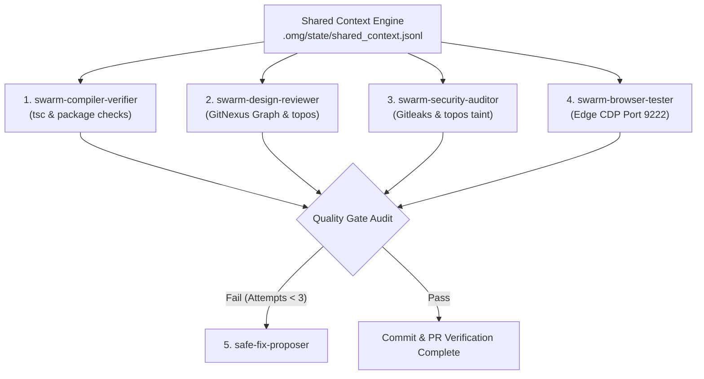

# Subagent Swarm Quality Verification Skill

This workspace skill defines the orchestration protocol for the multi-agent QA and verification swarm, aligning strictly with the architecture defined in [[production_agentic_pipeline_v2_1_blueprint]] and [[commit_creator_architecture_verifier_blueprint]].

---

## 1. Execution Profiles

When this skill is activated, the agent must parse the target profile to establish the verification lane:

| Profile | Trigger Condition | Mandatory Gates & Checks |
| :--- | :--- | :--- |
| **`fast`** | Default development checks, local commits | 1. Tier 1 Static Gate (TypeScript type check)<br>2. Secrets check (Gitleaks scan)<br>3. Unit/Integration Test execution (Vitest, Pytest) |
| **`strict`** | Pull Requests, pre-push, `/oma:goal` | 1. All `fast` profile checks<br>2. Parallel subagent audits (SOLID/GRASP & Security)<br>3. ChromeDevTools MCP (Port 9222) E2E layout and visual validation |

---

## 2. Mandatory Role: Swarm Coordinator

As the Swarm Coordinator, you are strictly forbidden from performing actual execution of verification tasks yourself. You act exclusively as a coordinator/dispatcher.

### Negative Constraints (Anti-Patterns)
* **DO NOT** execute local shell/terminal commands directly (e.g. running mock orchestrator scripts, Vitest test runs, or Pytest test runs in the main context).
* **DO NOT** invoke ChromeDevTools MCP or GitNexus MCP tools directly in your context.
* **DO NOT** write code-level design reviews or security audits yourself.
* **YOU MUST** delegate each of these tasks to their respective subagents using the `invoke_subagent` and `send_message` tools.

---

## 3. The 5 Swarm Subagent Personas

To run the verification swarm, the coordinator must instantiate the following 5 roles:



### 1. `swarm-compiler-verifier` (Role: "Compilation Verifier")
* **Objective**: Exclusive runner of builds, lints, and static type checks.
* **Tools**: Vitest (`npm test -- --run`) and Pytest (`server\.venv\Scripts\python.exe -m pytest server/tests`).
* **Environment Constraints**: Must execute in **Node 22 LTS** and **Python 3.12**.

### 2. `swarm-design-reviewer` (Role: "SOLID & GRASP Architect")
* **Objective**: Evaluate structural integrity, SOLID principles, and GRASP design patterns.
* **Tools**: GitNexus code intelligence CLI (`npx gitnexus impact` and `npx gitnexus context`), `topos`, and TypeScript compilation.
* **Metrics**: Analyzes Martin Instability metrics (fan-in/fan-out) over changed files to prevent high coupling across import boundaries.

### 3. `swarm-security-auditor` (Role: "Security Auditor")
* **Objective**: Audit diffs for vulnerabilities, hardcoded endpoints, or credential leaks.
* **Tools**: Gitleaks and `topos` source-to-sink data flow taint analysis.
* **CRITICAL POLICY**: **No auto-commit**. Any security issue found must abort execution and escalate to human review immediately.

### 4. `swarm-browser-tester` (Role: "E2E Browser Tester")
* **Objective**: Connect to Microsoft Edge/Chrome over CDP to verify UI state and accessibility.
* **Tools**: ChromeDevTools MCP (Port 9222) and `axe-core`.
* **CDP Operations**: Performs `click`, `fill`, and DOM snapshots (`take_snapshot`) on modified routes. Verifies console messages for runtime errors and confirms `aria-live="polite"` dynamic announcements.

### 5. `safe-fix-proposer` (Role: "Safe Fix Proposer")
* **Objective**: Apply trivial, style, or formatting fixes when Gates 1, 2, or 4 fail.
* **CRITICAL POLICY**: Limited to a maximum of **3 repair attempts** per verification loop. Escalates all complex code logic changes and security-related issues to a human.

---

## 4. State Engine & Shared Context Schema

All agents participating in the swarm must log their findings in the append-only JSON Lines state file:
👉 **[.omg/state/shared_context.jsonl](file:///D:/ForJobs/Qubiz/.omg/state/shared_context.jsonl)**

Each log entry must match one of the following schemas:

### Test Runner Write Schema
```json
{"timestamp":"2026-07-02T12:00:00Z","run_id":"run-104","agent":"swarm-compiler-verifier","status":"PASS","scope":["src/features/onboarding/OnboardingChecklist.tsx"],"metrics":{"vitest_passed":14,"pytest_passed":8}}
```

### ChromeDevTools Verifier Write Schema
```json
{"timestamp":"2026-07-02T12:00:02Z","run_id":"run-104","agent":"swarm-browser-tester","status":"PASS","cdp_port":9222,"aria_live_verified":true}
```

---

## 5. Orchestration Sequence & State Verification (Mandatory Flow)

To ensure deterministic execution and prevent bypasses, the main agent MUST follow this exact sequence:

1. **Step 1: Check Session Lock**: Read `.omg/state/session-lock.json` before initiating or writing to shared files. If not locked, write status logs to session-local drafts under `.omg/state/sessions/[session-slug]/workflow.md`.
2. **Step 2: Register Subagents**: Call `define_subagent` to configure the required subagents for the selected profile (`fast` or `strict`).
3. **Step 3: Parallel Subagent Invocation**: Invoke the subagents concurrently by sending them explicit task descriptions using the `send_message` tool.
4. **Step 4: Execution Wait-State (No Polling)**: Set a timer using `schedule` (e.g. 5 minutes, `TimerCondition="any"`) to handle hung agents. Call no more tools to wait for the subagents to report their completion.
5. **Step 5: Log Verification Gate**: Once subagents respond, parse `shared_context.jsonl`. Verify that all invoked subagents (`swarm-compiler-verifier`, `swarm-design-reviewer`, `swarm-security-auditor`, `swarm-browser-tester`) have logged a matching `timestamp` and `run_id` with a `"status": "PASS"` entry.
   - *CRITICAL*: Terminal output (stdout) from mock scripts or shell executions is NOT valid proof of execution.
6. **Step 6: Safe Fix Loop**: If failures are logged, delegate fixing tasks to `safe-fix-proposer`. Do not perform repairs directly in your coordinator context. Limit repair iterations to **3 attempts** before human escalation.

---

## 6. Related Vault Specifications

* 📘 **Pipeline Blueprint**: [[production_agentic_pipeline_v2_1_blueprint]]
* 📐 **Subagent Architecture**: [[commit_creator_architecture_verifier_blueprint]]
* 🔒 **Security Standards**: [[CI CD Standards]]
* ✍️ **Commit Guidelines**: [[Git Commit Standards]]
