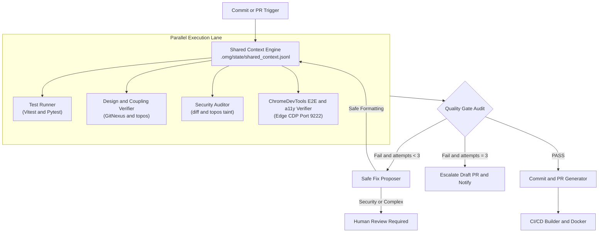

# Brutally Honest Pipeline Synthesis (Antigravity vs Claude vs Grok)

## Executive Summary
This document summarizes the **brutally honest architectural synthesis** comparing our initial **Antigravity V1/V2** blueprint, **Claude's V2** upgrade proposal, and **Grok's V2.1** production-readiness audit.

---

## 1. Comparative Evaluation Matrix

| Architectural Area | Antigravity V1/V2 | Claude V2 Proposal | Grok V2.1 Audit | Final Decision (v2.1) & Ratiune |
| --- | --- | --- | --- | --- |
| **E2E Browser Engine** | ChromeDevTools CDP on Port 9222 | Playwright preferred | CDP brittle in CI | **ChromeDevTools MCP (Port 9222) PĂSTRAT NEAPĂRAT** ca motor principal de automatizare vizuală, DOM snapshots și `aria-live`. |
| **Node.js Runtime** | Unspecified | Pinned Node 20 | 🚨 **EOL Alert**: Node 20 EOL la 30 Aprilie 2026. | **Node.js 22 LTS** (Zero vulnerabilități EOL). |
| **Python Runtime** | Unspecified | Pinned Python 3.11 | Python 3.11 în security maintenance. | **Python 3.12** |
| **Retry Loop Control** | Buclă nelimitată | Menționat limita | 🚨 **Risc de buclă infinită**: Consum infinit de token-uri. | **Plafon dur de Max 3 Încercări** + Escaladare la om. |
| **Securitate Auto-Fix** | Auto-commit fix-uri | Auto-Fixer | 🚨 **Coșmar de securitate**: Fără auto-commit pe securitate. | **Human-in-the-Loop obligatoriu** pentru securitate. |
| **Concursabilitate Stare** | Fișier unic `state.json` | JSON Lines (`.jsonl`) | Race conditions la scriere paralelă pe JSON simplu. | **Namespaced JSONL (`shared_context.jsonl`)**. |
| **Code Intelligence** | GitNexus | Neclar | GitNexus AST graph + `topos` coupling & taint. | **GitNexus + Topos (Martin Instability & Taint)**. |

---

## 2. What We Keep (The Gold Standard)

1. **ChromeDevTools MCP (Port 9222) Păstrat Neapărat**:
   - Engine-ul principal pentru automatizarea navigării, interacțiunilor (`click`, `fill`), verificării DOM-ului, consolei și accesibilității `aria-live`.
2. **Token Efficiency & Symbol Scoping**:
   - `diff_only: true` + symbol-level prompts (fără trimitere de fișiere întregi).
3. **GitNexus + Topos Code Intelligence**:
   - Utilizează graful AST GitNexus + metricile `topos` pentru coupling și tracking source-to-sink.
4. **Namespaced JSON Lines State (`.omg/state/shared_context.jsonl`)**:
   - Append-only scriere namespaced pentru eliminarea race condition-urilor.
5. **Hard-Capped Retry & Escalation Gate**:
   - Plafon dur de maxim 3 încercări cu escaladare automată la om.
6. **Human-in-the-Loop Guardrail**:
   - Modificările de securitate necesită aprobare umană obligatorie.

---

## 3. Final 5-Role Subagent Architecture

