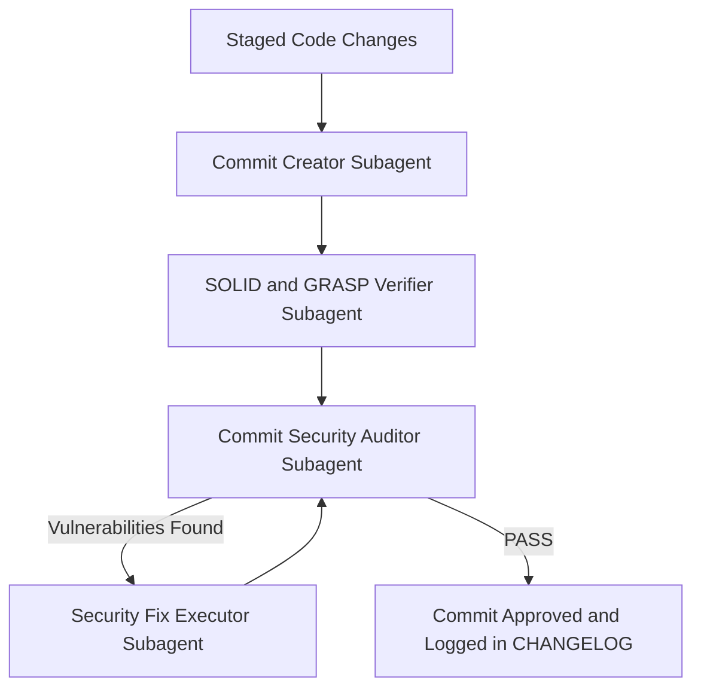
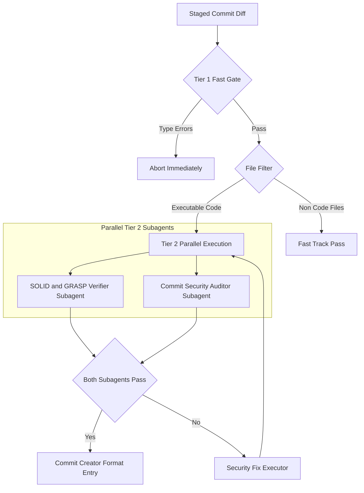

# Pre-Commit Subagent Hooks Architectural Review & Upgrade Plan

## Executive Summary
This document contains the complete architectural evaluation of the 4 pre-commit subagent hooks (`Commit Creator`, `SOLID/GRASP Verifier`, `Commit Security Auditor`, and `Security Fix Executor`) conducted by the **Hook Architecture Reviewer** subagent.

---

## 1. Original Pipeline Topology (Sequential Flow)

---

## 2. Identified Gaps, Risks and Bottlenecks

### Gap 1: High Latency & Developer Friction
- Executing 4 subagents sequentially introduces 20–40 seconds of latency per commit.
- Encourages developers to bypass checks via `git commit --no-verify`.

### Gap 2: Missing Deterministic Short-Circuit Gate
- Subagents were being launched even if the code contained basic syntax or TypeScript compilation errors (`tsc`).
- Wastes LLM context tokens identifying compilation issues that static compilers catch instantly.

### Gap 3: Unscoped Context & Lack of Cross-File Visibility
- Assessing SOLID/GRASP and security risks purely on staged diff chunks misses cross-file dependency graphs, class hierarchies, and data-flow taint paths across workspace boundaries.

### Gap 4: Working Tree Staging Mutation Risks
- Direct un-checked file edits by `Security Fix Executor` during pre-commit could corrupt partially staged files (`git add -p`).

---

## 3. Upgraded Two-Tiered Parallel Architecture Chart

---

## 4. Key Upgrades and Architectural Solutions

### Upgrade 1: Two-Tiered Parallel Execution
- **Tier 1 (Fast Deterministic Gate, < 1.5s)**: Runs static compilation check (`tsc --noEmit`). If syntax/type errors exist, it aborts instantly *before* calling subagents.
- **Tier 2 (Parallel Execution)**: Runs `SOLID/GRASP Verifier` and `Commit Security Auditor` **concurrently in parallel**, cutting pipeline latency by ~60%.
- **Pattern Filter**: Automatically bypasses non-code files (`.md`, `.json`, `.css`).

### Upgrade 2: Deep GitNexus Code Intelligence Integration
- **SOLID/GRASP Verifier**: Injects `gitnexus impact` and `route_map` to evaluate real coupling and cohesion metrics across import boundaries.
- **Commit Security Auditor**: Uses `gitnexus explain` and `trace` for source-to-sink data flow taint analysis across API boundaries.

### Upgrade 3: Safe Mutation Protocol
- `Security Fix Executor` validates code compilation after applying fixes before staging to prevent index corruption.

### Upgrade 4: Execution Profiles (`fast` vs `strict`)
- **`fast` (Default Dev Loop)**: Tier 1 static check + modified-diff security scan.
- **`strict` (Pre-Push / PR Gate)**: Full SOLID/GRASP evaluation + GitNexus graph impact analysis.

---

## 5. Summary Matrix of Pipeline Subagents

| Subagent | Role | Trigger Condition | Scope | GitNexus Tool |
| --- | --- | --- | --- | --- |
| **Commit Creator** | Formats small micro-commits & CHANGELOG entries | Pre-Commit Phase | Staged changes | `context()` |
| **SOLID/GRASP Verifier** | Audits OO design & clean code compliance | Tier 2 Parallel Gate | Diff only | `impact()`, `route_map()` |
| **Commit Security Auditor** | Scans for secret leaks & OWASP flaws | Tier 2 Parallel Gate | Diff only | `explain()`, `trace()` |
| **Security Fix Executor** | Applies surgical patches & re-tests | Security Auditor Failure | Modified diff lines | `detect_changes()` |
