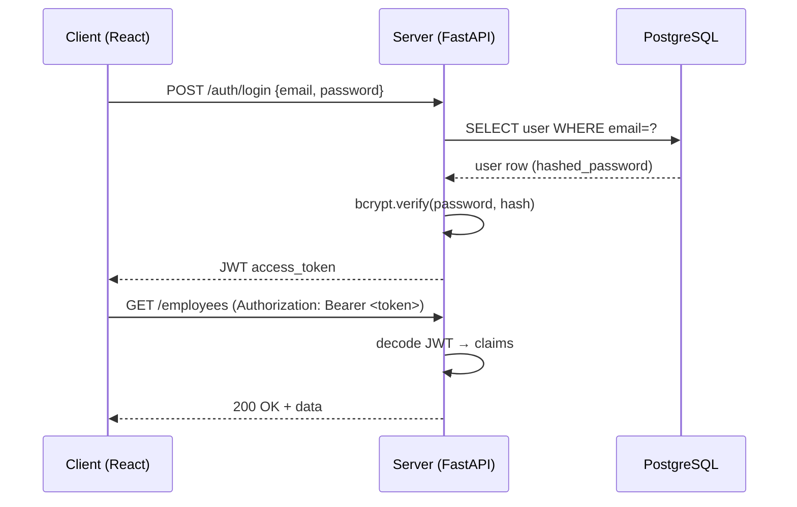
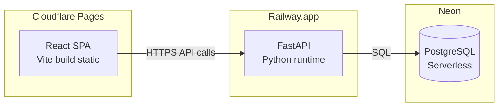

# 🏗️ Architecture & Deployment — Decizii Finale

Acest document descrie arhitectura finală revizuită și strategia de deployment pentru aplicația **Meridian Onboarding**. S-a trecut de la o arhitectură client-side SPA la un **full-stack cu backend Python (FastAPI)** și **PostgreSQL managed**, conform auditului adversarial și cerințelor de integritate referențială.

---

## 1. 🏛️ Arhitectura: Layered + Repository + Domain Events

> [!IMPORTANT]
> Monolith modular, **NU** microservicii. Toate modulele coexistă într-un singur proces, dar sunt separate logic prin straturi clare.

### Straturi (Layers)

```
Controllers (Routes) → Services → Repository Interfaces ← Implementări concrete
```

| Strat | Responsabilitate | Exemplu |
|-------|-----------------|---------|
| **Routes** (Controllers) | HTTP request/response, validare input via Pydantic | `routes/employees.py` |
| **Services** | Logică de business, orchestrare, emitere Domain Events | `services/employee_service.py` |
| **Repository Interfaces** | Contracte abstracte pentru persistență (SOLID — DIP) | `repositories/interfaces/` |
| **Implementări** | SQLAlchemy concrete, swap-uibile (Postgres/SQLite) | `repositories/implementations/` |

### Domain Events pentru Side-Effects Cross-Domain

În loc de coupling direct între module, side-effects-urile se propagă prin **Domain Events**:

| Eveniment | Handler | Efect |
|-----------|---------|-------|
| `EmployeeDeleted` | `cascade_delete.py` | Șterge checklist-urile și programările asociate |
| `BuddyDeleted` | `buddy_orphan.py` | Reasignează sau marchează angajații orfani (ghost buddy audit) |
| `AnyMutation` | `audit_log.py` | Înregistrează acțiunea în audit log |

> [!TIP]
> Domain Events decuplează modulele — adăugarea unui nou side-effect nu necesită modificarea serviciului original. SOLID compliance complet (OCP + DIP).

---

## 2. ⚙️ Stack Backend: FastAPI (Python)

### Justificare

- PDF-ul recomandă Python ca opțiune validă pentru backend
- **Cel mai rapid de prototipat** în deadline-ul de 10 zile
- Ecosistem matur: SQLAlchemy, Pydantic, bcrypt, PyJWT
- Pydantic = echivalentul server-side al Zod (validare + serializare automată)

### Componente cheie

| Componentă | Tehnologie | Rol |
|------------|-----------|-----|
| Framework | **FastAPI** | Async HTTP, OpenAPI docs automate |
| ORM | **SQLAlchemy 2.0** | Mapped classes, async sessions |
| Validare | **Pydantic v2** | Request/Response schemas, coercion |
| Migrații | **Alembic** | Versionare schemă DB |
| Hashing | **bcrypt** | Password hashing server-side |
| Auth tokens | **PyJWT** | JWT encode/decode |

---

## 3. 🗄️ Baza de Date: PostgreSQL pe Neon

> [!IMPORTANT]
> FK-uri reale, CASCADE DELETE nativ, constrângeri de unicitate. Rezolvă **toate** problemele de integritate referențială identificate în auditul adversarial.

### Producție — Neon (PostgreSQL Serverless)

- **Free tier** generos pentru demo/evaluare
- Connection pooling integrat (PgBouncer)
- Branching pentru preview environments
- Connection string: `postgresql://...@ep-xxx.neon.tech/meridian`

### Dezvoltare locală — SQLite (swap via Repository Pattern)

- Zero setup pentru dezvoltatori
- Același Repository Interface, implementare diferită
- Swap automat prin variabilă de environment (`DATABASE_URL`)

```python
# config.py — exemplu swap
if settings.DATABASE_URL.startswith("sqlite"):
    engine = create_engine(settings.DATABASE_URL)
else:
    engine = create_async_engine(settings.DATABASE_URL)
```

---

## 4. 🔐 Autentificare: JWT + bcrypt

### Flow de autentificare



### JWT Claims

```json
{
  "sub": "user-uuid",
  "email": "vlad@meridian.com",
  "role": "hr_admin",
  "department": "Engineering",
  "hireDate": "2026-08-15",
  "exp": 1751299200
}
```

### Reguli de securitate

| Regulă | Implementare |
|--------|-------------|
| Hashing parole | **bcrypt** server-side (înlocuiește Web Crypto API client-side) |
| Pre-boarding lock | `hireDate > now()` → acces restricționat la modulele de onboarding |
| Role-based access | Middleware FastAPI verifică `role` din JWT claims |
| Token expiry | Access token: 1h, Refresh token: 7d (opțional pentru demo) |

> [!NOTE]
> Pre-boarding lock se verifică **server-side**: dacă `hireDate` din JWT este în viitor, backend-ul restricționează accesul la endpoint-urile de onboarding activ.

---

## 5. ☁️ Deployment: Strategie Multi-Serviciu

### Configurație principală (recomandată)



| Serviciu | Platformă | Tier | Detalii |
|----------|----------|------|---------|
| **Frontend** | Cloudflare Pages | Free | Auto-deploy din Git, `_redirects` pentru SPA routing |
| **Backend** | Railway.app | Free tier | FastAPI cu Uvicorn, environment variables pentru secrets |
| **Database** | Neon | Free tier | PostgreSQL serverless, connection pooling inclus |

### Alternativă all-in-one (edge)

> [!TIP]
> Dacă se dorește simplificare maximă, întreaga aplicație poate rula pe edge cu un singur provider.

| Componentă | Tehnologie |
|------------|-----------|
| Runtime | **Cloudflare Workers** (Hono/TypeScript) |
| Database | **Cloudflare D1** (SQLite edge) |
| Frontend | **Cloudflare Pages** (același account) |

---

## 6. 📁 Structura Backend

```
server/
├── app/
│   ├── main.py                      ← FastAPI entry point
│   ├── config.py                    ← Settings, DB URL, secrets
│   ├── routes/
│   │   ├── auth.py                  ← Login, signup, refresh
│   │   ├── employees.py            ← CRUD angajați
│   │   ├── checklists.py           ← CRUD checklist-uri
│   │   ├── scheduler.py            ← Programări hybrid scheduler
│   │   └── backup.py               ← Export/import JSON
│   ├── domain/
│   │   ├── entities/                ← Domain models (Employee, Checklist, etc.)
│   │   ├── rules/                   ← Business rules (pre-boarding lock, etc.)
│   │   └── events/                  ← Event definitions (EmployeeDeleted, etc.)
│   ├── services/
│   │   ├── employee_service.py      ← Logică CRUD + emitere events
│   │   ├── checklist_service.py     ← Logică checklist per departament
│   │   ├── scheduler_service.py     ← Conflict detection, scheduling
│   │   ├── backup_service.py        ← Serializare/deserializare state
│   │   └── auth_service.py          ← JWT + bcrypt logic
│   ├── repositories/
│   │   ├── interfaces/              ← Abstract base classes (ABC)
│   │   └── implementations/         ← SQLAlchemy (Postgres + SQLite)
│   ├── event_handlers/
│   │   ├── cascade_delete.py        ← Cleanup la ștergere angajat
│   │   ├── buddy_orphan.py          ← Ghost buddy audit + reasignare
│   │   └── audit_log.py             ← Logging mutații
│   └── infrastructure/
│       ├── database.py              ← Engine, session factory
│       └── middleware.py            ← CORS, auth middleware, error handling
└── requirements.txt                 ← Dependencies pinned
```

---

## 7. 📁 Structura Frontend (actualizată pentru full-stack)

```
src/
├── api/                             ← HTTP client layer
│   ├── client.ts                    ← Axios/fetch instance + interceptors
│   ├── employeeApi.ts              ← Endpoints angajați
│   ├── checklistApi.ts             ← Endpoints checklist-uri
│   ├── schedulerApi.ts             ← Endpoints scheduler
│   └── authApi.ts                  ← Login, signup, refresh
├── hooks/                           ← React Query hooks (TanStack Query)
│   ├── useEmployees.ts             ← useQuery + useMutation employees
│   ├── useChecklist.ts             ← useQuery + useMutation checklists
│   ├── useScheduler.ts             ← useQuery + useMutation scheduler
│   └── useAuth.ts                  ← Login/logout/token management
├── context/                         ← Minimal — doar auth + theme
│   ├── AuthContext.tsx              ← JWT storage, decode claims, logout
│   └── ThemeContext.tsx             ← Dark/light mode toggle
├── features/                        ← Presentation only (pagini + componente feature)
└── components/                      ← Shared UI (Button, Modal, Table, etc.)
```

> [!NOTE]
> Față de arhitectura anterioară (client-side SPA), **localForage/IndexedDB a fost eliminat**. Toate datele vin acum de la backend via API. React Query gestionează caching, invalidare și optimistic updates.

---

## 8. 📊 Comparație: Arhitectura Veche vs. Nouă

| Aspect | Înainte (SPA client-side) | Acum (Full-Stack) |
|--------|--------------------------|-------------------|
| Persistență | localForage / IndexedDB | PostgreSQL (Neon) |
| Integritate date | Fără FK-uri, ștergere manuală | FK reale + CASCADE DELETE |
| Autentificare | Web Crypto API (client) | bcrypt + JWT (server) |
| Validare | Doar Zod (client) | Pydantic (server) + Zod (client) |
| Ghost buddy | Posibil, nedetectat | Domain Event → audit + reasignare |
| Deployment | Static hosting (1 serviciu) | 3 servicii (frontend + backend + DB) |
| Evaluare locală | `npm install && npm run dev` | `docker-compose up` sau `npm + uvicorn` |

---

## 🔗 Referințe

* [[Step-by-Step Plan]]
* [[1. Onboarding Checklist]]
* [[2. Hybrid Scheduler]]
* [[3. Employee Directory]]
* [[4. Database Backup]]
