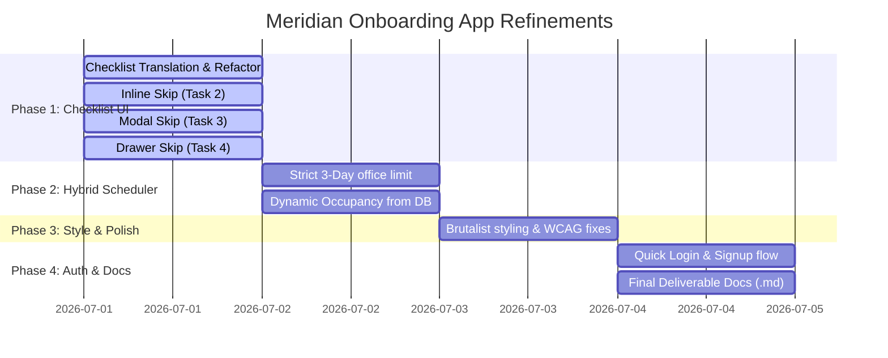

# 🚀 Implementation Blueprint & Subagent Plan

This document outlines the granular plan to refine the **Meridian Onboarding App** frontend. To fulfill the **Divide et Impera** rule and separate workspace contexts safely, we split the requirements into 4 phases of microtasks. A dedicated subagent will be launched sequentially for each microtask.

---

## 📅 Roadmap Overview

---

## 🗂️ Detailed Task Breakdown & Subagents

### 🟩 Phase 1: Onboarding Checklist & Skip Flows
*Goal: Align UI buttons and specific skip mechanisms with Playwright testing assertions.*

| Task ID | Microtask Goal | Target File | Assigned Subagent |
| :--- | :--- | :--- | :--- |
| **1.1** | Translate all button labels to English (`Complete Task`, `Skip Task...`, `Reset Checklist`). | [[OnboardingChecklist.tsx]] | `ChecklistTranslator` |
| **1.2** | Implement **Inline Skip** panel inside Task-2 card (`"Inline Skip Action:"`, placeholder `"Specify reason for skipping..."`, `"Cancel"` & `"Confirm"` buttons). | [[OnboardingChecklist.tsx]] | `InlineSkipDeveloper` |
| **1.3** | Implement **Modal Skip** overlay for Task-3 (`"Skip Compliance Check"`, textarea placeholder `"Provide skip justification statement here..."`, `"Submit Justification"` button). | [[OnboardingChecklist.tsx]] | `ModalSkipDeveloper` |
| **1.4** | Implement **Drawer Skip** slide-out panel for Task-4 (`"Skip Audit Flow"`, textarea placeholder `"Explain why this step is bypassed..."`, `"Log Bypass & Flag HR"` button). | [[OnboardingChecklist.tsx]] | `DrawerSkipDeveloper` |

---

### 🟨 Phase 2: Hybrid Scheduler & Office Occupancy
*Goal: Implement business rules and database state dynamic checking.*

| Task ID | Microtask Goal | Target File | Assigned Subagent |
| :--- | :--- | :--- | :--- |
| **2.1** | Enforce a hard lock preventing users from choosing >3 office days per week. | [[HybridScheduler.tsx]] | `SchedulerRuleDeveloper` |
| **2.2** | Compute total office occupancy dynamically from local database instead of using static mock values. Enable warning alert when occupancy $\ge 124$. | [[HybridScheduler.tsx]] | `OccupancyCalculatorDeveloper` |

---

### 🟦 Phase 3: Visual Polish & Styling
*Goal: Ensure design systems and accessibility rules match Swiss/Brutalist standards.*

| Task ID | Microtask Goal | Target File | Assigned Subagent |
| :--- | :--- | :--- | :--- |
| **3.1** | Refine typography, margins, padding, and borders to fit `design.md`. Correct WCAG contrast issues (e.g. replacing hard-to-read cyan colors on white backgrounds). | `index.css`, features CSS | `AestheticsSpecialist` |

---

### 🟪 Phase 4: Authentication & Delivery Docs
*Goal: Finalize user registration, login interfaces, and require onboarding documentation.*

| Task ID | Microtask Goal | Target File | Assigned Subagent |
| :--- | :--- | :--- | :--- |
| **4.1** | Ensure quick-login buttons and user signup features save and read profiles from IndexedDB. | [[LoginPage.tsx]] | `AuthDeveloper` |
| **4.2** | Write the mandatory markdown deliverables in the root folder: `ASSUMPTIONS.md`, `DECISIONS.md`, and `WHAT_I_WOULD_DO_NEXT.md` based on decision boards. | Root files | `DocumentationSpecialist` |

---

> [!IMPORTANT]
> To comply with the user's instructions: **No subagents will be spawned and no modifications will be made until you explicitly approve this plan.**
