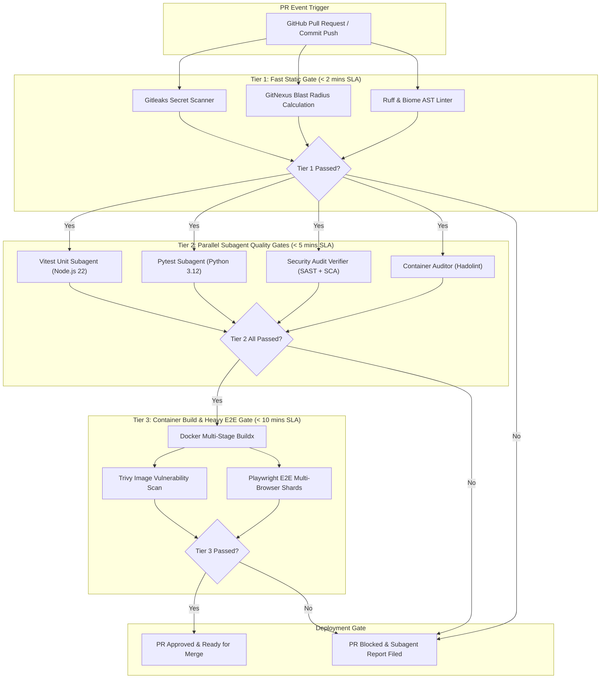
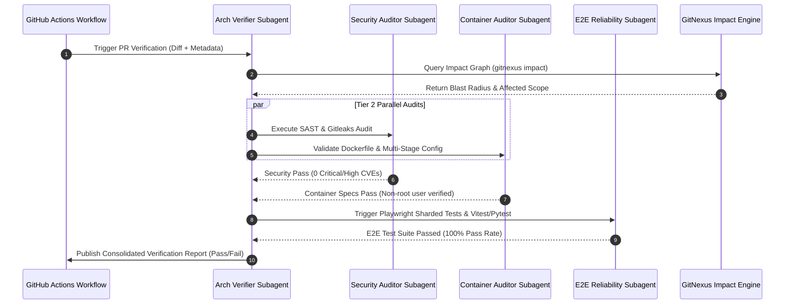

# CI/CD Architecture Verifier & Pipeline Auditor Blueprint

> [!IMPORTANT]
> **Executive Summary**: This blueprint defines a state-of-the-art, 3-tiered autonomous CI/CD architecture verifier and pipeline auditing framework optimized for modern **GitHub Actions** workflows. It incorporates strict verification gates across **Node.js 22 LTS**, **Python 3.12**, **Playwright E2E**, **Docker multi-stage builds**, **Gitleaks secret detection**, **Vitest**, **Pytest**, and **GitNexus graph-based impact analysis**.

---

## 1. Architectural Overview & 3-Tier Verification Hierarchy

The architecture employs a **fail-closed, multi-stage verification pipeline** managed by specialized AI subagents. Each tier acts as a quality gate with strict SLAs and deterministic exit codes.



---

## 2. Detailed Verification Tiers & SLAs

### Tier 1: Fast Static Gate & Secret Scanner (< 2 min SLA)
- **Primary Objective**: Immediate feedback on syntax errors, secret leaks, and change impact scoping.
- **Fail-Closed Thresholds**:
  - `Gitleaks`: Any detected secret (API keys, RSA keys, JWT tokens) aborts pipeline immediately.
  - `GitNexus Impact`: Computes changed symbol set and assigns a **Blast Radius Score (0-100)**.
  - `Ruff / Biome`: Zero syntax errors allowed.

> [!CAUTION]
> If Gitleaks detects a secret leak in Tier 1, the pipeline terminates immediately with exit code `1` before spinning up expensive runner instances or running subagent LLM tasks.

### Tier 2: Parallel Subagent Quality & Security Gates (< 5 min SLA)
Executed concurrently across isolated runner jobs:
1. **Node.js 22 LTS Vitest Subagent**:
   - Node 22 native ESM execution, thread-pool isolation (`vitest --pool=threads`).
   - Line coverage gate: **≥ 85%**.
2. **Python 3.12 Pytest Subagent**:
   - Python 3.12 with subinterpreter support, parallel execution via `pytest-xdist`.
   - Line coverage gate: **≥ 85%**.
3. **Security Audit Verifier**:
   - SAST scan with Semgrep / CodeQL.
   - SCA (Software Composition Analysis) for Node `package.json` and Python `pyproject.toml`.
   - Zero High/Critical CVEs allowed.
4. **Container Build Auditor (Static)**:
   - Hadolint validation of `Dockerfile` against best practices (pinning base image tags, non-root user creation).

### Tier 3: Container Build & E2E Reliability Gate (< 10 min SLA)
1. **Docker Multi-Stage Buildx**:
   - BuildKit caching with GitHub Actions inline cache (`type=gha`).
   - Multi-stage targeting: `builder` -> `runner` distroless / non-root base images.
2. **Container Security**:
   - Trivy scan on final container image layer.
3. **Playwright E2E Subagent**:
   - Multi-browser execution (Chromium, Firefox, WebKit) distributed across 4 matrix shards (`--shard=1/4`).
   - Web-first assertions, automatic trace artifacts upload on failure.

---

## 3. Sequence Diagram: Subagent Orchestration



---

## 4. GitNexus Impact Analysis Integration

The pipeline uses [[cicd_architecture_verifier_subagent|GitNexus Subagent Tools]] to dynamically adapt verification rigor based on PR blast radius:

```
[PR Code Changes] 
       │
       ▼
┌──────────────────────────────┐
│  GitNexus Impact Analysis    │
│  - AST Code Graph Scanning   │
│  - Call Graph Analysis       │
│  - API Contract Check        │
└──────────────┬───────────────┘
               │
      ┌────────┴────────┐
      ▼                 ▼
[Blast Radius < 30]   [Blast Radius ≥ 30 or Breaking API]
      │                 │
      ▼                 ▼
Standard Tier 2/3     Escalated Tier 3 (Full Regression + E2E Sharding)
```

- **Blast Radius < 30**: Targeted test execution based on touched modules.
- **Blast Radius ≥ 30 or Breaking API Changes**: Escalates E2E run to execute full regression suite across all browser engines.

---

## 5. Fail-Closed Quality Guardrails Summary

| Quality Gate | Tool | Threshold / Criterion | Action on Failure |
| :--- | :--- | :--- | :--- |
| Secret Scanning | **Gitleaks** | 0 Secrets Detected | Hard Stop (Exit Code 1) |
| Impact Analysis | **GitNexus** | Blast Radius Scoped | Escalates Test Depth |
| Node.js Unit | **Vitest (Node 22)** | ≥ 85% Code Coverage | Fail PR Check |
| Python Unit | **Pytest (Python 3.12)** | ≥ 85% Code Coverage | Fail PR Check |
| Container Lint | **Hadolint** | 0 Rule Violations (DL3000+) | Fail PR Check |
| Container Scan | **Trivy** | 0 High/Critical CVEs | Fail PR Check |
| E2E Testing | **Playwright** | 100% Pass Rate | Fail PR Check & Save Traces |

---

## 6. Related References & Resources

- [[cicd_architecture_verifier_subagent|CI/CD Subagent Detailed Specifications]]
- [[security_audit_verifier|Security Audit Verifier]]
- [[container_build_auditor|Container Build Auditor]]
