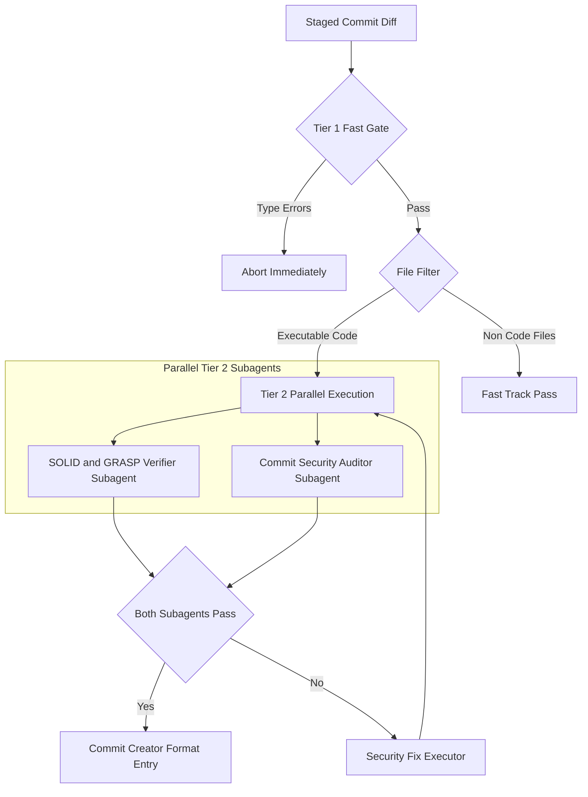

# Upgraded Two-Tiered Pre-Commit Subagent Pipeline Blueprint

## 1. Executive Summary & Upgraded Architecture
Based on the architectural review by the **Hook Architecture Reviewer** subagent, the commit pipeline is upgraded from a sequential model to a **Two-Tiered Parallel Execution Architecture**:

---

## 2. Key Architectural Upgrades

### Upgrade 1: Two-Tiered Tiered Execution Architecture
- **Tier 1 (Fast Deterministic Gate, < 1.5s)**:
  - Runs static type check (`tsc --noEmit` / `mypy`).
  - Halts execution instantly if syntax/compilation errors are present, saving LLM tokens and preventing hallucinated fixes.
- **Tier 2 (Parallel Subagent Analysis)**:
  - Executes `SOLID/GRASP Verifier` and `Commit Security Auditor` **concurrently in parallel**.
  - Applies pattern filters to bypass non-code files (`.md`, `.json`, `.css`).

### Upgrade 2: Automated GitNexus AST Code Intelligence
- **SOLID/GRASP Verifier**: Queries `gitnexus impact` and `route_map` to evaluate coupling across import boundaries.
- **Commit Security Auditor**: Uses `gitnexus explain` and `trace` for source-to-sink data flow taint analysis across API boundaries.

### Upgrade 3: Safe Mutation & Staging Protocol
- `Security Fix Executor` validates code compilation after applying fixes before staging to prevent index corruption.

### Upgrade 4: Execution Profiles (`fast` vs `strict`)
- `fast` (Default dev loop): Tier 1 static checks + modified-diff security auditor.
- `strict` (Pre-push / PR gate): Full SOLID/GRASP audit + GitNexus graph impact analysis.

---

## 3. Vault Artifacts & Specification Matrix
- 📘 **Blueprint**: `vault/10_Projects/commit_creator_architecture_verifier_blueprint.md`
- 🛠️ **Subagent Specs**: `vault/20_Resources/commit_creator_and_architecture_verifier_subagents.md`
