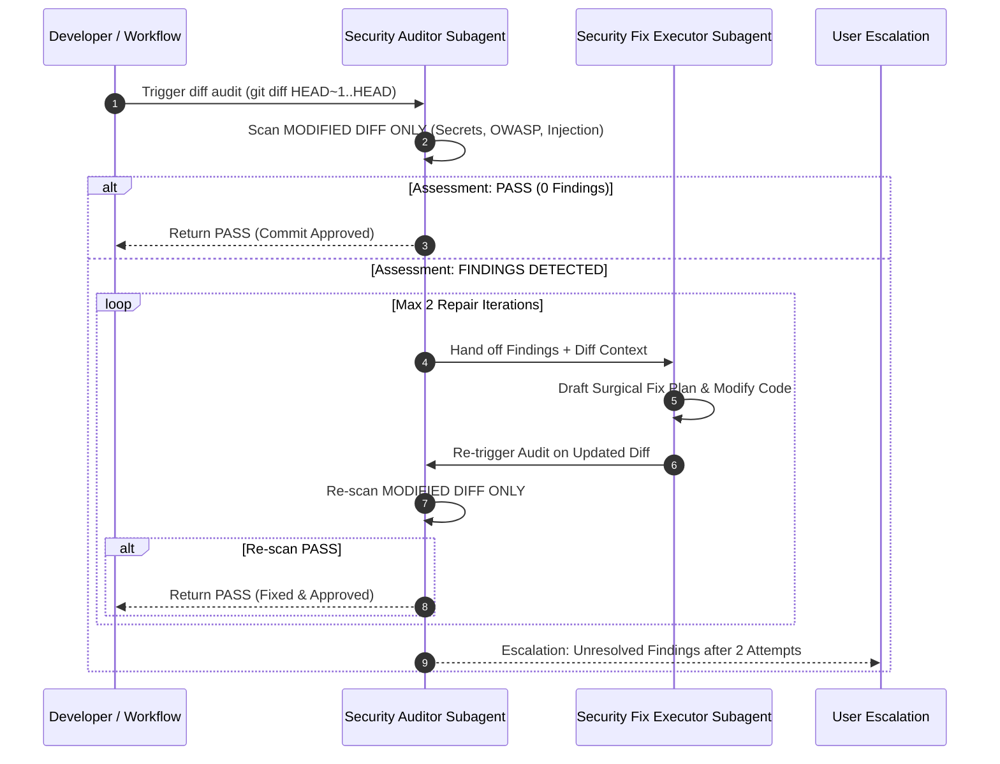

# Commit Vulnerability Subagent Blueprint & Auto-Remediation Loop

## 1. Overview & Objectives
This architecture provides an **autonomous multi-subagent security audit and repair loop**:
1. **Security Auditor Subagent** (`Commit Security Auditor`): Inspects **only new commit diffs** (`git diff HEAD~1..HEAD` or staged changes). Does NOT scan unchanged parts of the codebase.
2. **Remediation Subagent** (`Security Fix Executor`): If security findings are detected, this subagent formulates a surgical fix plan and modifies the affected diff lines.
3. **Re-Scan & Verification Gate**: The Security Auditor re-scans the updated diff.
4. **User Escalation Policy**: If findings persist after **2 repair iterations**, the system halts execution and escalates the remaining security issues directly to the user.

---

## 2. Autonomous Multi-Subagent Repair Sequence

---

## 3. Scope Boundaries & Strict Constraints

- **Diff-Only Isolation**: Analysis is strictly bounded to modified files and diff hunks (`git diff`). Unmodified codebase files are excluded to minimize token overhead and prevent unnecessary edits.
- **Surgical Code Modifications**: The Remediation Subagent only touches code directly linked to reported security findings.
- **Hard Limit**: Maximum 2 automated repair cycles. If an issue requires architectural changes or human decision-making, it escalates to the user.
