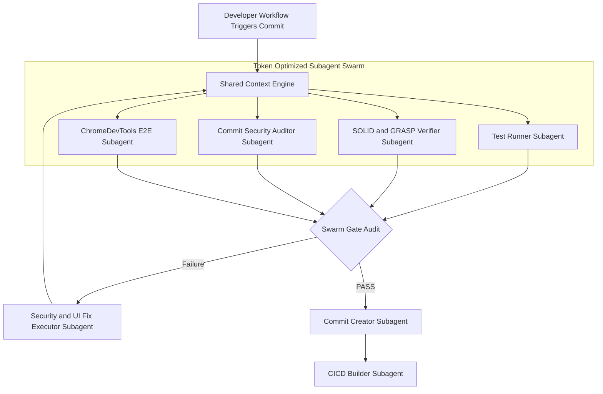

# Full E2E Subagent Swarm & CI/CD Pipeline Blueprint

## 1. Executive Summary & Architecture Overview

This blueprint establishes a **Multi-Subagent Swarm Pipeline** engineered for **high-thoroughness quality assurance** combined with **strict token-efficiency**.

Subagents communicate through a **Shared Context Engine** (`.omg/state/shared_context.json`), passing compact diff hashes, symbol IDs, and test result payloads rather than re-sending full source files.

---

## 2. Token Optimization & Shared Context Protocol

To prevent context window bloating across multiple subagents:
1. **Compact Shared Context Index** (`.omg/state/shared_context.json`):
   - Stores git diff hashes, line ranges, modified symbol names, test result summaries, and ChromeDevTools CDP session tokens.
2. **Symbol-Based Handoffs**:
   - Subagents pass symbol IDs (e.g., `src/features/onboarding/OnboardingChecklist.tsx#handleCopySlackIntro`) instead of full file contents.
3. **Diff-Only Isolation**:
   - Every subagent prompt is constrained to inspect **only changed diff lines**, eliminating unneeded source code token overhead.

---

## 3. The 7-Subagent Swarm Roles

| Subagent Role | Target Domain | Key Responsibilities |
| --- | --- | --- |
| **Test Runner Subagent** | Code Tests | Executes Vitest (Frontend React) & Pytest (Backend FastAPI). |
| **SOLID/GRASP Verifier** | OO Design | Audits diffs via GitNexus AST impact & coupling metrics. |
| **Commit Security Auditor** | Vulnerability Scan | Scans diffs for secrets, OWASP Top 10, & injection risks. |
| **ChromeDevTools E2E Subagent** | Live UI Verification | Controls Microsoft Edge (Port 9222) via CDP to test clicks, forms, & `aria-live`. |
| **Security/UI Fix Executor** | Auto-Remediation | Applies surgical fixes when tests, security, or UI audits fail. |
| **Commit Creator** | Commit Structure | Formats micro-commits in `CHANGELOG.md` per vault standards. |
| **CI/CD Builder** | Release & Pipeline | Manages `.github/workflows/ci.yml` & Docker container builds. |

---

## 4. GitHub Actions CI/CD & Local Hook Strategy
- **Local Pre-Commit/Pre-Push**: Runs Tier 1 static checks (`tsc`, `vitest`, `pytest`) + visible ChromeDevTools CDP verification on Edge (port 9222).
- **Remote CI/CD (`.github/workflows/ci.yml`)**: Automatically runs multi-stage workflow on push/PR:
  1. `frontend-tests`: Node 20 + `npm run test:run` (Vitest).
  2. `backend-tests`: Python 3.11 + `pytest server/tests`.
  3. `security-scan`: Secret scanning + OWASP dependency check.
  4. `docker-build`: Multi-stage non-root container build validation (`docker-compose build`).

---

## 5. Vault Artifact References
- 📘 **Blueprint**: `vault/10_Projects/full_e2e_subagent_pipeline_blueprint.md`
- 🛠️ **Subagent Swarm Specs**: `vault/20_Resources/e2e_subagent_swarm_specifications.md`
- ⚙️ **Shared Context Engine**: `.omg/state/shared_context.json`
- 🚀 **GitHub Actions Workflow**: `.github/workflows/ci.yml`
