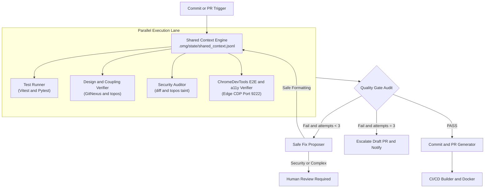

# Production-Grade E2E Agentic Quality Pipeline v2.1 Blueprint

## 1. Executive Summary & Core Philosophy

This blueprint defines a **production-grade, observable, and token-efficient agentic QA and CI/CD pipeline**.

### Key Non-Negotiable Core Principle:
- **ChromeDevTools MCP (Port 9222) is KEPT as the PRIMARY Visual & E2E Engine**:
  - Connects directly to Microsoft Edge / Chrome on port 9222.
  - Controls live UI interactions (`click`, `fill`), captures DOM snapshots (`take_snapshot`), inspects runtime console messages (`get_console_message`), and verifies `aria-live="polite"` accessibility announcements.

---

## 2. System Architecture Diagram



---

## 3. The 5 Consolidated Agent Roles

| Agent Role | Primary Tools | Responsibilities & Boundaries |
| --- | --- | --- |
| **1. Test Runner** | Vitest, Pytest | Executes unit/integration tests with coverage thresholds. Fast short-circuit. |
| **2. Design & Coupling Verifier** | GitNexus, `topos`, `tsc` | Computes Martin Instability and fan-in/fan-out metrics via GitNexus AST graph. |
| **3. Security Auditor** | Gitleaks, Trivy, `topos` taint | Scans diffs for secrets and source-to-sink taint reachability. **No auto-commit**. |
| **4. ChromeDevTools E2E & a11y Verifier** | ChromeDevTools MCP (Port 9222), axe-core | **KEPT AS PRIMARY**: Controls Microsoft Edge via CDP for live click/fill automation, visual DOM snapshots, and `aria-live` accessibility checks. |
| **5. Safe Fix Proposer** | LLM + Git patch engine | Applies trivial/formatting fixes. **Escalates all security/complex diffs to humans**. |

---

## 4. State Engine & Shared Context Schema (`.omg/state/shared_context.jsonl`)

State entries are logged in append-only JSON Lines format with namespaced agent writes:

```json
{"timestamp":"2026-07-02T12:00:00Z","run_id":"run-104","agent":"test-runner","status":"PASS","scope":["src/features/onboarding/OnboardingChecklist.tsx"],"metrics":{"vitest_passed":14,"pytest_passed":8}}
{"timestamp":"2026-07-02T12:00:02Z","run_id":"run-104","agent":"chromedevtools-e2e","status":"PASS","cdp_port":9222,"aria_live_verified":true}
```

---

## 5. Production Safety Guardrails & Failure Policy

1. **ChromeDevTools MCP Priority**:
   - Live CDP testing on port 9222 against Edge is the primary visual and DOM assertion mechanism.
2. **Max 3 Repair Attempt Ceiling**:
   - If tests or security checks fail, `Safe Fix Proposer` is granted at most 3 repair iterations.
   - On the 3rd failure, the pipeline halts, opens a draft PR, and notifies human engineers.
3. **Human-in-the-Loop Gate for Security**:
   - Any modification to security-sensitive code or secret-scanner findings **MUST** be approved by a human engineer.
4. **Runtime & Dependency Pinned Versions**:
   - Node.js: **22 LTS** (Node 20 EOL on April 30, 2026).
   - Python: **3.12**.

---

## 6. GitHub Actions Workflow Configuration (`.github/workflows/ci-agentic.yml`)

The production CI workflow is located at **[.github/workflows/ci-agentic.yml](file:///D:/ForJobs/Qubiz/.github/workflows/ci-agentic.yml)**.
