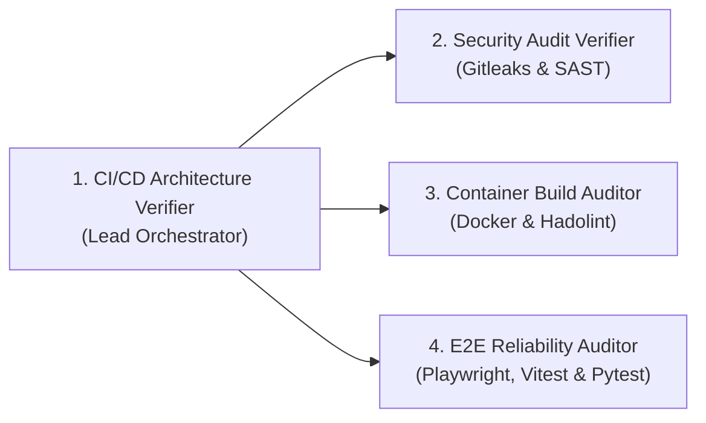
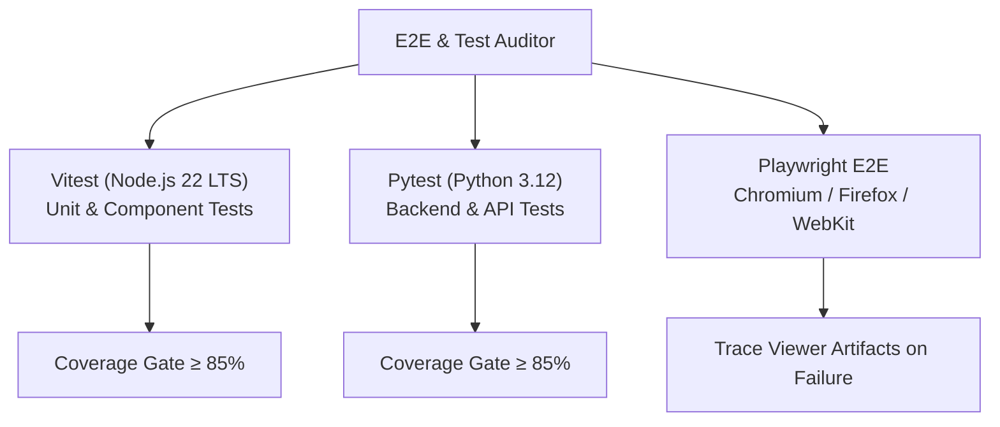

# CI/CD Architecture Verifier Subagent Specifications

> [!NOTE]
> This document details the functional specifications, system prompts, verification rule sets, input/output schemas, and fail-closed mechanisms for the four core subagents operating within the [[cicd_architecture_verifier_blueprint|CI/CD Architecture Verifier System]].

---

## 1. Subagent Persona Matrix



---

## 2. Lead Orchestrator: CI/CD Architecture Verifier

### Role & Objective
Serves as the central pipeline evaluator and quality gate manager. It parses PR metadata, invokes specialized auditor subagents, aggregates findings, enforces fail-closed policies, and publishes GitHub Check Run status reports.

### System Prompt Specification
```markdown
You are the Lead CI/CD Architecture Verifier.
Your responsibility is to enforce strict architectural integrity, performance SLAs, and security compliance on incoming GitHub Pull Requests.

Operational Guidelines:
1. Inspect PR diffs and query GitNexus impact analysis for modified files.
2. Delegate specialized audits to Security Audit Verifier, Container Build Auditor, and E2E Reliability Auditor.
3. Enforce FAIL-CLOSED behavior: If any subagent reports a blocking error, security vulnerability, or failed test suite, mark the overall pipeline status as FAILED.
4. Ensure target runtimes comply strictly with Node.js 22 LTS and Python 3.12.
```

### Input Schema
```json
{
  "pr_number": 142,
  "commit_sha": "a1b2c3d4e5f6",
  "base_branch": "main",
  "changed_files": ["src/api/auth.ts", "Dockerfile", "pyproject.toml"],
  "environment": {
    "node_version": "22.x",
    "python_version": "3.12"
  }
}
```

---

## 3. Security Audit Verifier Subagent

### Role & Objective
Audits code diffs and dependencies for secret leaks, static security vulnerabilities, dependency license violations, and breaking API changes.

### Core Verification Rules
- **Secret Scanning**: Runs Gitleaks against all commit SHAs in the PR.
- **Dependency Audit**: Validates `npm audit` (Node 22) and `uv audit` / `pip-audit` (Python 3.12).
- **GitNexus Contract Audit**: Ensures exported API interfaces have matching integration tests.

### Fail-Closed Triggers
- Any detected API key, JWT token, or SSH private key in Git diff.
- Any unresolved `HIGH` or `CRITICAL` CVE in direct dependencies.

---

## 4. Container Build Auditor Subagent

### Role & Objective
Ensures Docker container configurations follow enterprise security patterns, multi-stage optimization, and BuildKit caching standards.

### System Prompt Specification
```markdown
You are the Container Build Auditor.
Validate all Dockerfiles and container image configurations against strict production standards:
1. Multi-stage build separation (Builder vs Minimal Runtime Image).
2. Explicit base image tag pinning (e.g., node:22-alpine, python:3.12-slim).
3. Non-root user execution enforcement (USER node / USER app user).
4. Zero Hadolint rules violations (DL3000 through DL4000 series).
```

### Verification Checklist
- [x] Multi-stage build pattern present.
- [x] Base image tags explicitly pinned (no `latest` tags allowed).
- [x] Non-root user specified before `ENTRYPOINT` / `CMD`.
- [x] Layer caching optimized (copy package manifests before source files).

---

## 5. E2E & Unit Test Reliability Auditor Subagent

### Role & Objective
Manages Vitest (Node 22), Pytest (Python 3.12), and Playwright E2E test suite execution, coverage evaluation, and test flake detection.

### Test Matrix & Framework Integration



### Fail-Closed Rules
- **Vitest & Pytest**: Code coverage < 85% fails build.
- **Playwright E2E**: Any unhandled page crash, visual regression mismatch, or failed assertion fails build.

---

## 6. Decision Matrix & Output Schema

The Lead Verifier produces a standardized evaluation artifact upon completion:

```json
{
  "verification_id": "ver-2026-0702-001",
  "status": "PASSED",
  "fail_closed_triggered": false,
  "summary": {
    "tier1_fast_gate": "PASSED (0 secrets, Blast Radius: 18)",
    "tier2_quality_gate": "PASSED (Vitest: 91%, Pytest: 88%, Security: Clean)",
    "tier3_e2e_gate": "PASSED (Playwright: 24/24 passed across 4 shards)"
  },
  "subagent_reports": {
    "security_verifier": { "status": "PASSED", "secrets_found": 0, "cves": 0 },
    "container_auditor": { "status": "PASSED", "hadolint_warnings": 0, "non_root": true },
    "e2e_auditor": { "status": "PASSED", "flaky_tests_detected": 0 }
  }
}
```

---

## 7. Related Notes & References

- [[cicd_architecture_verifier_blueprint|CI/CD Architecture Verifier Blueprint]]
- [[security_audit_verifier|Security Audit Verifier Reference]]
- [[github_actions_runner_matrix|GitHub Actions Runner Setup]]
