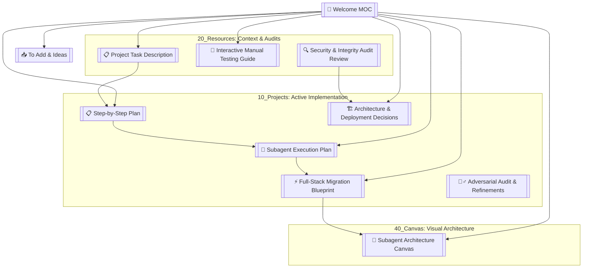

# 🌌 Welcome to the Meridian Onboarding Second Brain

This Obsidian vault is organized using the **PARA Method** to support the engineering design, requirements coordination, and full-stack development of the **Meridian Onboarding Web Application**.

---

## 🗺️ Knowledge Graph (Vault Map)

---

## 📂 Vault Structure & Directory Map

### 📥 01_Inbox (Quick Capture & Backlog)
*A landing zone for quick notes, ideas, and items to be processed.*
* [[01_Inbox/To Add|📝 To Add & Backlog Items]] - Missing features, verification tasks, and open questions.
* [[01_Inbox/Commit History Evaluation|🔍 Commit History Evaluation]] - Brutally honest audit of repository commits vs industry standards.

### 📁 10_Projects (Active Implementation & Blueprints)
*Active plans, roadmaps, and step-by-step guides for full-stack migration.*
* [[10_Projects/Step-by-Step Plan|📋 Step-by-Step Plan]] - Reviews current features, gaps, and lists the backend development roadmap.
* [[10_Projects/5. Architecture and Deployment|🏗️ Architecture & Deployment Decisions]] - In-depth breakdown of the modular layered design, FastAPI endpoints, and multi-service deployment.
* [[10_Projects/6. Adversarial Audit & Refinements|🕵️‍♂️ Adversarial Audit & Refinements]] - Resolving data integrity and pre-boarding vulnerabilities.
* [[10_Projects/Execution Plan|🚀 Subagent Execution Plan]] - Sequencing of frontend improvements (historical).
* [[10_Projects/Full Stack Execution Plan|⚡ Full-Stack Migration Blueprint]] - Active database models, API route specifications, and sequential subagent tasks.

### 📚 20_Resources (Reference & Context)
*Static reference materials, requirements, specifications, and testing protocols.*
* [[20_Resources/task/TaskDescription|📋 Project Task Description]] - Raw email instructions and PDF analysis.
* [[20_Resources/Architecture Audit Review|🔍 Security & Integrity Audit Review]] - Critical analysis of the backend database integrity and concurrency strategy.
* [[20_Resources/Interactive Manual Testing Guide|🧪 Interactive Manual Testing Guide]] - Step-by-Step testing instructions and assertions.
* [[20_Resources/Git Commit Standards|📝 Git Commit Standards]] - Industry standards for Conventional Commits and 50/72 formatting limits.

### 🎨 40_Canvas (Visual Architecture)
*Visual layouts mapping system relations.*
* [[40_Canvas/subagent_architecture.canvas|🤖 Subagent Architecture Canvas]] - Flowchart connecting coordinator, subagents, files, and dependencies.

---

> [!TIP]
> This vault conforms to the **Obsidian Flavored Markdown** standard. You can open the `vault` subdirectory directly in the Obsidian desktop/mobile app to navigate via interactive graphs, links, and visual canvases.
